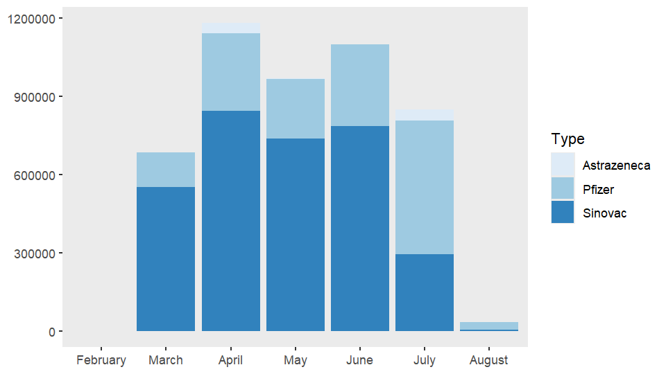
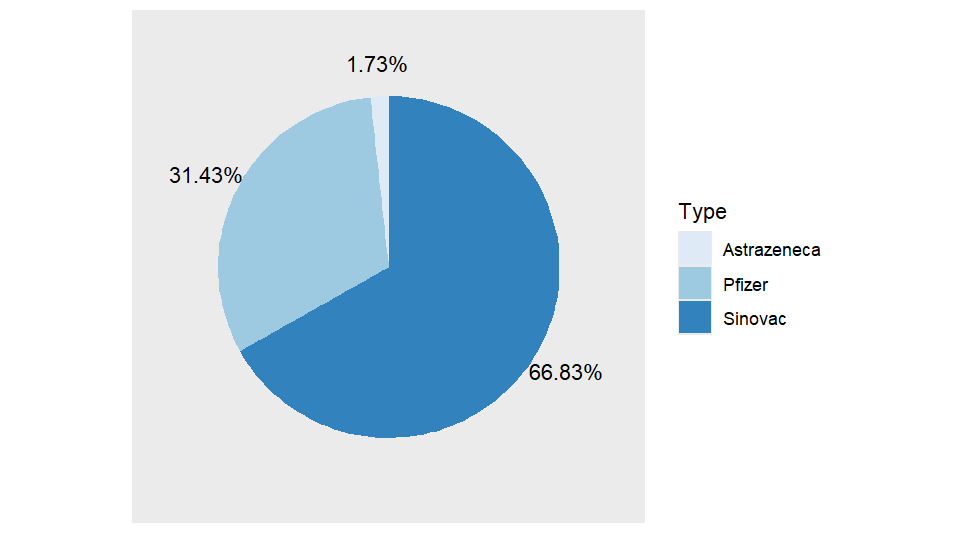

# COVID-19 vaccination in Uruguay

Covid 19 vaccination charts created with R.

### Description

Graphic representation of the proportion of total vaccination doses administered for each vaccine type and the monthly trends in vaccination activities for different vaccine types.

### Vaccination events per month

### Vaccination events by type
