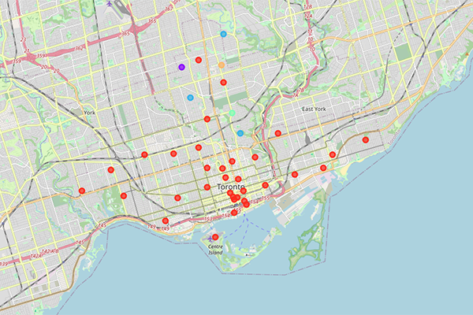

# Distribution center

This project was created with several Python libraries and the Foursquare API.

### Description
The objective of this work is to locate the best place to build a distribution center to deliver home products from farmers markets, markets, convinience stores supermarkets and
shopping malls. The distribution center will be located in the neighborhood with the largest number of farmers markets, convenience stores,
supermarkets and shopping malls nearby.

### Venues map
 