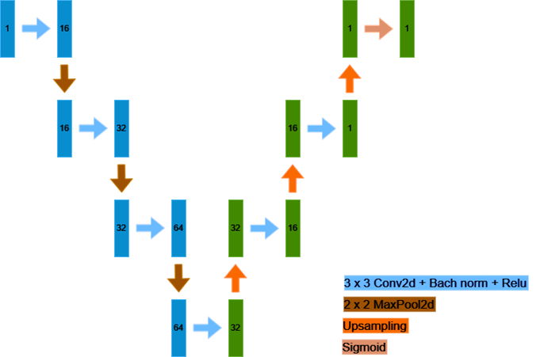
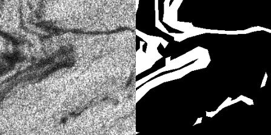

# U-Net
Neural network architecture for image segmentation developed with pytorch.

### Description
UNet is a convolutional neural network architecture designed for semantic segmentation tasks. It consists of an encoder-decoder structure with skip connections, enabling precise localization of objects in images. The encoder captures contextual information through downsampling, while the decoder upsamples and refines the segmentation map.

### Network diagram
 

### Prediction example
 